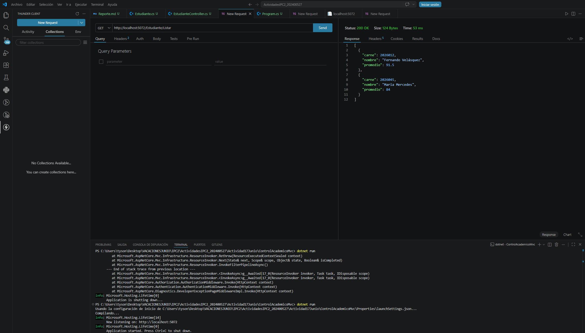
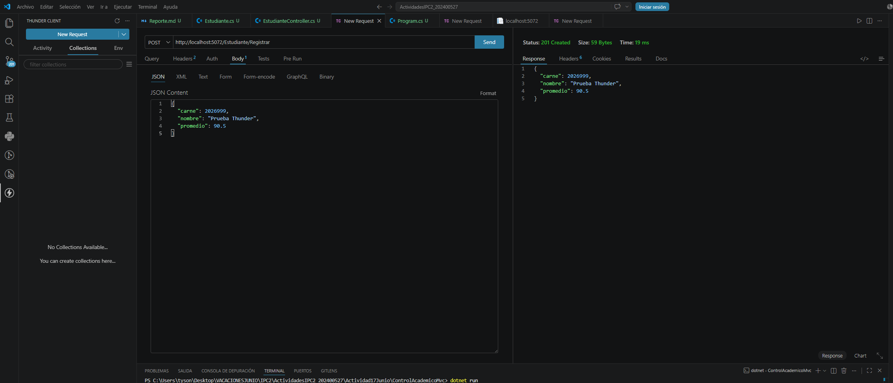

# Reporte de Laboratorio: Arquitectura Multi-Nivel y Patrón Lógico de Software (MVC) en .NET

## Parte 1: Fundamentación Teórica y Análisis Crítico

### 1. El Tránsito hacia los Sistemas Distribuidos y Multi-Capa

**La Limitación del Monolito Local:**
Cuando la interfaz, la lógica de negocio y el almacenamiento de datos residen de forma exclusiva en una máquina física aislada, se generan graves problemas de sincronización y escalabilidad. Si el sistema demanda más recursos por un alto volumen de usuarios, no es posible escalar componentes de forma independiente, agotando la capacidad del servidor. Además, representa un punto único de fallo: si la máquina se apaga, todo el sistema colapsa.

**Distinción Crítica (Layers vs. Tiers):**
Las **Capas Lógicas (Layers)** se refieren a la separación puramente conceptual del código fuente dentro del mismo proyecto (carpetas, namespaces, clases) para organizar las responsabilidades del software. En contraste, los **Niveles Físicos (Tiers)** implican la separación de dichos componentes en infraestructura física distinta (diferentes servidores o máquinas conectados por red) donde se ejecuta y despliega el código.

**Responsabilidades en la Arquitectura de 3 Niveles:**
* **Nivel 1: Capa de Presentación (Presentation Tier):** Su misión exclusiva es proveer la interfaz visual con la que interactúa el usuario (capturar entradas y mostrar salidas). Utiliza tecnologías front-end (HTML, CSS, interfaces móviles o de escritorio).
* **Nivel 2: Capa de Aplicación o Negocio (Application Tier):** Procesa las reglas de negocio, realiza validaciones matemáticas y lógicas, y actúa como el cerebro intermedio entre la interfaz y los datos. Suele emplear lenguajes de backend como C# o Java.
* **Nivel 3: Capa de Datos (Data Tier):** Se encarga de la persistencia, almacenamiento y recuperación segura de la información. Emplea sistemas gestores de bases de datos (RDBMS como SQL Server) y sistemas de almacenamiento.

**Seguridad Perimetral:**
Exponer públicamente a internet el puerto de una base de datos es un error crítico porque permite conexiones directas desde el exterior, facilitando ataques de fuerza bruta, inyección de consultas maliciosas o secuestro de información. La buena práctica recomendada es colocar la base de datos en una red interna o privada accesible única y exclusivamente por la Capa de Aplicación, la cual actúa como filtro validando y sanitizando todas las peticiones antes de interactuar con los datos.

---

### 2. Desacoplamiento Lógico con el Patrón MVC

**La Crisis del Código Espagueti:**
Mezclar sentencias SQL, lógica matemática y etiquetas visuales (HTML) dentro de un mismo archivo físico imposibilita el mantenimiento del software, ya que un simple cambio visual puede romper la lógica de datos. Además, impide el diseño de pruebas unitarias aisladas, pues no se puede probar una fórmula matemática sin tener que cargar también los elementos gráficos y la conexión a la base de datos, violando el principio de responsabilidad única.

**Separación de Preocupaciones (SoC) - Trygve Reenskaug:**
* **Modelo:** Representa la lógica de datos, las entidades y las reglas del dominio. Tiene estrictamente prohibido conocer o depender de cómo se muestran los datos (es agnóstico a la UI).
* **Vista:** Se define como una entidad pasiva y presentacional. Tiene estrictamente prohibido contener sentencias SQL, llamadas a servicios externos o lógica matemática compleja; su único trabajo es tomar datos inyectados y generar el formato visual.
* **Controlador:** Su rol es ser el director de orquesta e intermediario táctico de la red. Recibe las solicitudes HTTP del usuario, pide al Modelo que procese los datos y, posteriormente, elige la Vista adecuada para inyectarle dichos resultados.

**Métricas de Ingeniería de Software:**
El patrón MVC asegura una **Alta Cohesión**, garantizando que cada bloque de código se enfoque exclusivamente en su única tarea (la vista solo renderiza, el modelo solo gestiona datos). A su vez, logra un **Bajo Acoplamiento**, permitiendo que un equipo modifique la vista visual sin afectar la base de datos, o que se cambie el motor de base de datos sin tener que reescribir la interfaz gráfica.

---

## Parte 2: Modelado del Ciclo de Vida y Enrutamiento Semántico

### 1. Mapeo Analítico de URLs
Aplicando la plantilla jerárquica `{controller=Home}/{action=Index}/{id?}`:

| URL Entrante del Cliente | Clase Controladora Buscada por el Framework | Método (Acción) Ejecutado | Parámetro Inyectado `id` |
| :--- | :--- | :--- | :--- |
| `https://ingenieria.usac.edu.gt/ControlAcademico/Login` | `ControlAcademicoController` | `Login` | (Ninguno / Opcional) |
| `https://ingenieria.usac.edu.gt/Estudiante/Historial/20260123` | `EstudianteController` | `Historial` | `20260123` |
| `https://ingenieria.usac.edu.gt/Asignacion/Detalle/10` | `AsignacionController` | `Detalle` | `10` |
| `https://ingenieria.usac.edu.gt/Home` | `HomeController` | `Index` (Por defecto) | (Ninguno / Opcional) |

---

### 2. Diagramación del Flujo Interactivo

Viaje completo de una petición HTTP en MVC:
1. **Petición del Usuario:** El usuario interactúa con la interfaz (por ejemplo, clic en un botón) y el navegador envía una petición web HTTP al servidor.
2. **Enrutamiento y Asignación:** El framework intercepta la petición HTTP, analiza la URL entrante basándose en su patrón de enrutamiento y dirige la ejecución al Controlador correspondiente.
3. **Intervención del Controlador y Modelo:** El Controlador asume el mando y delega el trabajo pesado al Modelo, solicitándole que valide reglas de negocio, extraiga o guarde datos de la memoria o base de datos.
4. **Respuesta del Modelo y Selección de Vista:** El Modelo retorna los datos limpios al Controlador. El Controlador, actuando como intermediario, selecciona una Vista específica y le inyecta esta información.
5. **Renderizado y Retorno:** La Vista, siendo una entidad pasiva, utiliza los datos inyectados para renderizar dinámicamente el código HTML. Este resultado se devuelve al Controlador, quien finalmente lo envía como respuesta HTTP al navegador web del usuario.

---
## Parte 4: Auditoría y Control de Calidad

A continuación, se adjunta la evidencia de las pruebas de enrutamiento y validación de los Controladores Delgados utilizando Thunder Client.

**1. Prueba de Cohesión (Petición GET):**
Demuestra que el controlador responde correctamente en la ruta `/Estudiante/Listar` despachando la lista inicial.

**2. Prueba de Creación (Petición POST):**
Demuestra que el controlador recibe el JSON en `/Estudiante/Registrar`, lo procesa sin lógica pesada y devuelve el estado 201 Created.

**3. Verificación de Inserción (Petición GET Actualizada):**
Verificación del estado de los datos en memoria después del POST.

## Referencias Bibliográficas

* > Facultad de Ingeniería, USAC. (2026). *Sesión 11: Modelado Base y Arquitecturas de Despliegue. Evolución de Sistemas Distribuidos, Fundamentos del Modelo Cliente-Servidor y Diseño Físico Multi-Capas (N-Tier)*. Laboratorio del curso Introducción a la Programación y Computación 2. Guatemala.
* > Facultad de Ingeniería, USAC. (2026). *Sesión 12: Arquitectura y Componentes del Patrón MVC. Desacoplamiento Lógico de Software, Ciclo de Vida de las Peticiones y Enrutamiento en Aplicaciones Interactivas Modernas*. Laboratorio del curso Introducción a la Programación y Computación 2. Guatemala.
* > Microsoft. (2023). *Información general sobre ASP.NET Core MVC*. Microsoft Learn. Recuperado de: https://learn.microsoft.com/es-es/aspnet/core/mvc/overview
* > Microsoft. (2023). *Enrutamiento a acciones del controlador en ASP.NET Core*. Microsoft Learn. Recuperado de: https://learn.microsoft.com/es-es/aspnet/core/mvc/controllers/routing
* > Microsoft. (2023). *Vistas en ASP.NET Core MVC*. Microsoft Learn. Recuperado de: https://learn.microsoft.com/es-es/aspnet/core/mvc/views/overview